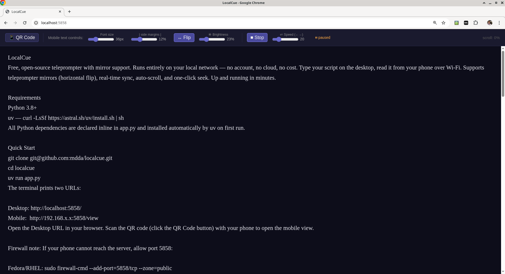
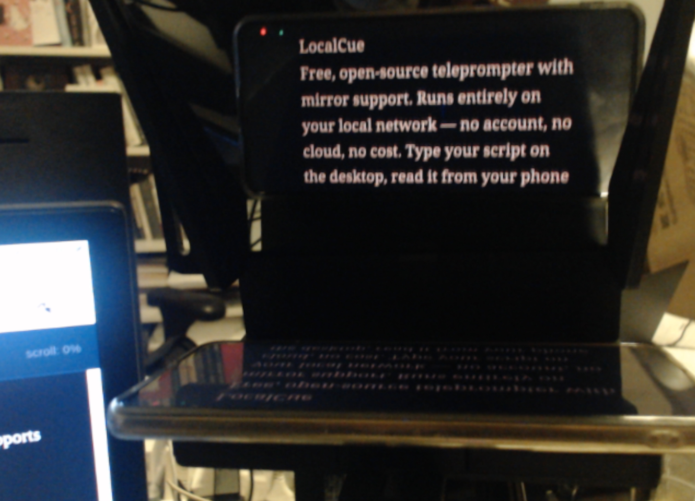

# LocalCue

**Free, open-source teleprompter with mirror support.** 
Runs entirely on your local network — no account, no cloud, no cost. 
Type your script on the desktop, read it from your phone over Wi-Fi. Supports teleprompter mirrors (horizontal flip), real-time sync, auto-scroll, and one-click seek. Up and running in minutes.





## Requirements

- Python 3.8+
- [uv](https://docs.astral.sh/uv/getting-started/installation/) — `curl -LsSf https://astral.sh/uv/install.sh | sh`

All Python dependencies are declared inline in `app.py` and installed automatically by `uv` on first run.

## Quick Start

```bash
git clone git@github.com:mdda/localcue.git
cd localcue
uv run app.py
```

The terminal prints two URLs:

```
Desktop: http://localhost:5858/
Mobile:  http://192.168.x.x:5858/view
```

Open the Desktop URL in your browser. Scan the QR code (click the **QR Code** button) with your phone to open the mobile view.

> **Firewall note:** If your phone cannot reach the desktop machine running `uv run app.py`, open port 5858 in its firewall:
> - **Fedora/RHEL:** `sudo firewall-cmd --add-port=5858/tcp --zone=public`
> - **Ubuntu/Debian:** `sudo ufw allow 5858`
> - **macOS:** System Settings → Network → Firewall → Options → allow incoming connections for Python (or disable the firewall for trusted home networks)
> - **Windows:** Windows Defender Firewall will prompt when the app first runs — click **Allow**. Or manually: `netsh advfirewall firewall add rule name="Teleprompter" dir=in action=allow protocol=TCP localport=5858`

## Mobile Setup — Fullscreen via "Add to Home Screen"

The mobile view (`/view`) is designed to run fullscreen so the browser address bar does not eat into the display area.

**Quick fullscreen (Android Chrome):** tap anywhere on the mobile display to toggle fullscreen on/off. A faint "tap for fullscreen" hint appears briefly on load as a reminder.

**Persistent fullscreen via Add to Home Screen (Android Chrome):**
1. Open the mobile URL in Chrome.
2. Tap the three-dot menu (⋮) in the top-right corner.
3. Tap **Add to Home Screen**.
4. Accept the prompt.
5. Open the app from your home screen — it launches fullscreen with no browser chrome.

**On iOS (Safari):**
1. Open the mobile URL in Safari.
2. Tap the Share button (box with arrow).
3. Tap **Add to Home Screen**.
4. Open it from your home screen for fullscreen display.

## Controls (Desktop)

| Control | Description |
|---|---|
| **QR Code** | Shows a scannable QR code and URL for the mobile view — close with **Esc**, click outside, or the Close button |
| **Font size** slider | Sets text size on the mobile display (16–96 px) |
| **\| side margins \|** slider | Sets horizontal padding on the mobile display (0–40%) |
| **↔ Flip** | Toggles left-right mirror on mobile (highlighted = mirrored, for use with a teleprompter mirror) |
| **☀ Brightness** slider | Dims the white text on mobile (0–100%) — useful if bright text reflects in glasses |
| **▶ Play / ⏹ Stop** | Toggles Play Mode — see below |
| **⇄ Speed** slider | Auto-scroll speed in px/s on the mobile display (1–100, default 30) |
| **scroll: N%** | Shows your current position through the script |

## Scroll Control

### Mouse wheel

Scroll the mouse wheel anywhere on the desktop page to advance the mobile teleprompter view. The behaviour differs by horizontal mouse position:

| Mouse position | Behaviour |
|---|---|
| Left 25% of screen | Proportional scroll — desktop textarea and mobile track together |
| Right 75% of screen | **Exactly one line per wheel click** on the mobile display |

The right-side one-line-per-click mode uses the mobile's actual rendered line height (reported back automatically), so it stays accurate regardless of font size or script length.

### Click to seek

**Click anywhere in the desktop textarea** to jump the mobile view to that point in the script. The clicked line is positioned as the 3rd line from the top of the mobile display, making it easy to resume after editing.

## Play Mode

Click **▶ Play** to enter Play Mode. Arrow keys then control auto-scroll instead of moving the desktop cursor.

| Key | Action |
|---|---|
| `↓` (when paused) | Start auto-scrolling at the current speed |
| `↓` (while scrolling) | Skip forward ~2 seconds of movement |
| `↑` (while scrolling) | Pause — no position change |
| `↑` (while paused) | Skip back ~6 seconds of movement |
| `←` / `→` | Decrease / increase speed by 5 |

The speed slider (1–100) represents pixels per second on the mobile display, so the same value feels consistent regardless of script length. At the default of 30 px/s with a 36 px font, the scroll rate is roughly 0.5 lines per second — comfortable reading pace.

A status indicator next to the slider shows **▶ playing** (green) or **⏸ paused** (amber) while in Play Mode.

Click **⏹ Stop** to exit Play Mode and restore normal arrow-key behaviour in the textarea.

## Screen Wake Lock (Mobile)

The mobile view requests a [Screen Wake Lock](https://developer.mozilla.org/en-US/docs/Web/API/Screen_Wake_Lock_API) on load, on each fullscreen tap, and every 30 seconds as a fallback — preventing the screen from dimming during a take. A small dot in the top-right corner of the mobile view shows the lock status:

| Colour | Meaning |
|---|---|
| Blue | Wake lock is active |
| Red | Wake lock failed or not supported |
| Grey | Pending (page just loaded) |

**If the dot is red on Android:** the browser's battery optimisation is blocking the API.
- Settings → Apps → (your browser) → Battery → **Unrestricted**
- Settings → Battery → Battery Saver → **Off**

**If the dot is red on iOS Safari:** the Wake Lock API is not supported. Use Chrome for iOS (iOS 16.4+), or add the page to your Home Screen as a PWA.

**Reliable fallback (any device):** Settings → Display → Screen timeout → **Never** (safe when plugged in).

## Workflow

1. **Prepare:** paste or type your script in the desktop textarea.
2. **Set up mobile:** scan the QR code, open the link, add to home screen, launch fullscreen.
3. **Adjust:** use the sliders to set font size, margins, and brightness to suit your lighting and mirror.
4. **Flip:** confirm the **↔ Flip** button is highlighted (mirrored) if you are using a physical teleprompter mirror; un-flip for direct reading without a mirror.
5. **Position:** click a line in the desktop textarea to jump the mobile view to that point.
6. **Record:** use Play Mode (▶) with arrow keys for hands-free auto-scroll, or scroll manually with the mouse wheel.
7. **Recover:** if you lose your place, press **↑** to pause, then click the correct line in the desktop textarea to seek back to it.
